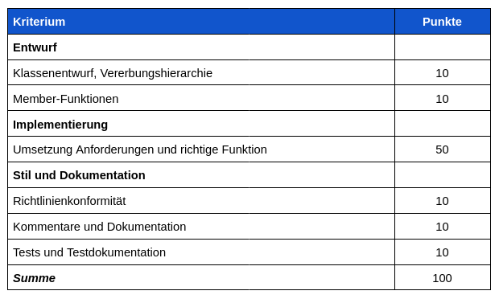

# C23 - Projekt - WS21
### Rahmenbedingungen
Ausgehend von einem vorgegebenen Lastenheft bearbeitet jede Person ein Software-Projekt und erstellt
<ol type="a">
  <li>Klassendiagramm (JPEG- oder PNG-Format)</li>
  <li>C++ Quellcode und Clion Projekt (.zip)</li>
  <li>Ausführbares Programm</li>
  <li>Tests und Testdokumentation</li>
</ol>

Die Arbeitsergebnisse a, b und d geben Sie bitte über Moodle als Projektergebnis ab.
Abgabetermin ist der 21.02.2022.  
Für jede Person wird es zusätzlich einen Einsichts Termin geben, wo kurz überprüft wird ob der Code selbständig erstellt wurde.
(Termine sind in den 2 Wochen nach der Abgabe - Online)

### Kontext - U-Bahn-Fahrten in Berlin planen
Um die Attraktivität des öffentlichen Nahverkehrs in Berlin zu verbessern, plant die BVG die Einführung einer Software, die Touristen und Einwohner bei der Planung ihrer Fahrten mit der Berliner U-Bahn
unterstützt. Die Software soll jeweils die kürzeste und/oder schnellste Verbindung zwischen zwei
U-Bahn-Stationen ermitteln, und dabei Umsteigezeiten und ggf. Streckensperrungen Berücksichtigen.

### Anforderungen
Sie sollen eine Software schreiben (Konsolenanwendung), die die Verwaltung und Nutzung von Verbindungsdaten eines öffentlichen Verkehrsnetzes unterstützt.  
Die Software soll dem Benutzer folgende Funktionen zur Verfügung stellen:

<ol>
  <li>Die Software soll Netzdaten aus einer Datei einlesen und in eine Datei ausgeben können. Die Datei soll für jede Verbindung zwischen zwei Stationen folgende Struktur aufweisen: Linie Stationsname1 -> Stationsname2: Entfernung-Km Zeitbedarf-Minuten</li>
  <li>Netz-Daten sollen auch manuell in der Software eingegeben werden können und existierende Netz-Daten ergänzen oder ändern.</li>
  <li>Die Software soll Netz-Daten (Haltestellen, Verbindungen zwischen Haltestellen, Linieninformationen) nach verschiedenen durch den Nutzer zu wählenden Auswahl- und Ordnungskriterien sortiert als Bildschirmlisten ausgeben können. Folgende Kriterien sollen mindestens unterstützt werden:  
a. Nach Linie sortiert | b. Alphabetisch sortiert.</li>
  <li>Die Software soll die Auswahl beliebiger Start- und Ziel-Stationen gestatten und dann die optimale Verbindung zwischen diesen Stationen berechnen und detailliert ausgeben. Die Nutzer sollen auswählen können, ob nach Zeitbedarf oder nach Entfernung optimiert werden soll.</li>
  <li>Die Software soll an Umsteigebahnhöfen beim Wechseln von einer Linie auf die andere 10 Minuten Umsteigezeitbedarf einplanen.</li>
  <li>Die Nutzer sollen die Software beenden können. Dabei soll die Möglichkeit bestehen, geänderte Netzdaten in eine Datei auszugeben.</li>
</ol>  
  
Die Software soll folgenden Randbedingungen entsprechen:
* Die Software soll die Netzdaten unter Nutzung der GraphLib-Bibliothek verwalten, und optimale Wege unter Nutzung des in der Bibliothek umgesetzten Djikstra-Algorithmus ermitteln.
* Die Software soll Fehleingaben vermeiden (z.B. durch Nutzung von Auswahllisten statt der textuellen Eingabe von Stationsnamen) und soll sinnvoll auf Fehlersituationen reagieren. Zur Fehlerbehandlungen sollten Exceptions benutzt werden.
* Für die Implementierung der Software sollen vorzugsweise Klassen, Templates und Funktionen der C++-Standardbibliothek benutzt werden.
* Die Software soll bei Beendigung alle allokierten Speicherbereiche dediziert freigeben.
* Die Software soll den Vorgaben der Programmierrichtlinien entsprechen (siehe Moodle).
* Die Software soll umfassend mithilfe von Kommentaren im Doxygen-Stil dokumentiert sein.
* Die Software soll mithilfe der zur Verfügung gestellten Beispieldaten getestet sein.

### Bewertung

